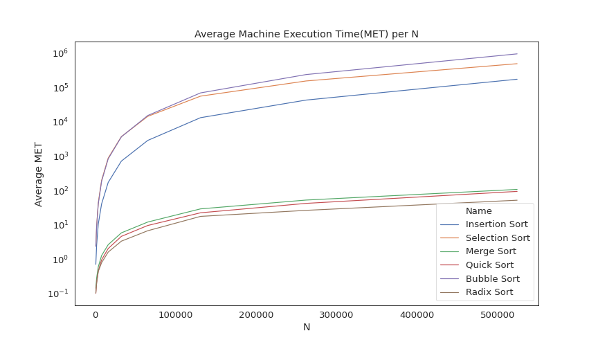
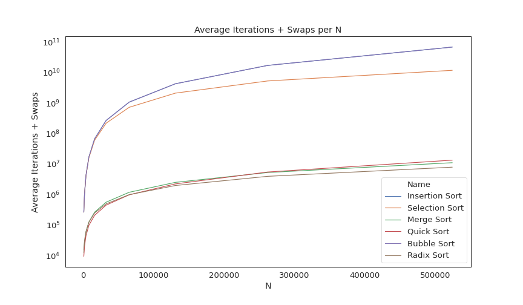

# Basic Sorting Algorithms Analysis
For this project, we analyze the **Machine Execution Time(MEP)** and **the number of iterations + swaps** of `Bubble Sort`, `Insertion Sort`, `Selection Sort`, `Merge Sort`, `Quick Sort`, and `Radix Sort` Algorithms by _simulating each sorting algorithm given a random valued array of 1024*2^n elements where n = 0 to 9_. This was done to gain a better understanding how each sort performs depending on an increasing number elements.

## Project Summary
Language used:
- C (Simulation)
- Python 3.8.3 (Data Analysis)

Time it took to finish the simulation: 14.5 hours

## Results
#### Average MET per Sorting Algorithm
| N               | Bubble Sort     | Insertion Sort  | Selection Sort  | Merge Sort      | Quick Sort      | Radix Sort      | 
| --------------- | --------------- | --------------- | --------------- | --------------- | --------------- | --------------- | 
| 1024            | 2.363955        | 0.704316        | 2.368381        | 0.141708        | 0.100678        | 0.103824        | 
| 2048            | 8.846344        | 2.587275        | 9.454002        | 0.284963        | 0.210359        | 0.20109         | 
| 4096            | 40.380803       | 10.555163       | 44.163441       | 0.598471        | 0.455142        | 0.439045        | 
| 8192            | 183.860378      | 40.384209       | 197.446497      | 1.27158         | 0.951894        | 0.787564        | 
| 16384           | 830.435517      | 170.951239      | 877.871219      | 2.633427        | 2.033615        | 1.603994        | 
| 32768           | 3637.597676     | 714.502013      | 3695.017597     | 5.826049        | 4.605925        | 3.337504        | 
| 65536           | 15177.406779    | 2856.760789     | 14323.86917     | 12.025149       | 9.544604        | 6.715105        | 
| 131072          | 69047.183346    | 13119.679616    | 55570.80337     | 29.072486       | 22.343117       | 17.569152       | 
| 262144          | 236129.661678   | 42683.497168    | 153623.9945     | 52.462741       | 42.023032       | 26.320142       | 
| 524288          | 945600.287781   | 172686.431336   | 489191.2488     | 107.159727      | 93.791742       | 51.952815       |  

  

#### Average Iterations + Swaps per Sorting Algorithm
| N               | Bubble Sort     | Insertion Sort  | Selection Sort  | Merge Sort      | Quick Sort      | Radix Sort      | 
| --------------- | --------------- | --------------- | --------------- | --------------- | --------------- | --------------- | 
| 1024            | 261953.04       | 261953.04       | 259913.48       | 12287.0         | 9252.48         | 15410.0         | 
| 2048            | 1048761.36      | 1048761.36      | 1033742.16      | 26623.0         | 19906.4         | 30770.0         | 
| 4096            | 4198883.36      | 4198883.36      | 4084588.28      | 57343.0         | 43705.72        | 61490.0         | 
| 8192            | 16750353.96     | 16750353.96     | 15888569.32     | 122879.0        | 96352.84        | 122930.0        | 
| 16384           | 67149982.76     | 67149982.76     | 60425985.12     | 262143.0        | 207278.36       | 245810.0        | 
| 32768           | 268257468.8     | 268257468.8     | 218456428.48    | 557055.0        | 446802.12       | 491570.0        | 
| 65536           | 1073258550.6    | 1073258550.6    | 725394370.44    | 1179647.0       | 973214.56       | 983090.0        | 
| 131072          | 4293419017.76   | 4293419017.76   | 2116052820.6    | 2490367.0       | 2217265.68      | 1966130.0       | 
| 262144          | 17174156576.64  | 17174156576.64  | 5310514086.72   | 5242879.0       | 5445535.28      | 3932210.0       | 
| 524288          | 68743549408.52  | 68743549408.52  | 11859402810.92  | 11010047.0      | 13355166.68     | 7864370.0       |  

## CPU Info
| Label                    | Value                                      |
| ------------------------ | ------------------------------------------ |
| Vendor ID                | GenuineIntel                               |
| Model name               | Intel(R) Core(TM) i7-7700HQ CPU @ 2.80GHz  |
| Architecture             | x86_64                                     |
| Model                    | 158                                        |
| CPU family               | 6                                          |
| Stepping                 | 9                                          |
| CPU MHz                  | 3538.502                                   |
| CPU max MHz              | 3800.0000                                  |
| CPU min MHz              | 800.0000                                   |
| CPU(s)                   | 8                                          |
| Thread(s) per core       | 2                                          |
| Core(s) per socket       | 4                                          |
| Socket(s)                | 1                                          |
| NUMA node(s)             | 1                                          |
| BogoMIPS                 | 5599.85                                    |
| Virtualization           | VT-x                                       |

## Credits
- Thanks to GeeksforGeeks for providing an amazing explanation of each sorting method which allowed us to gain a better insight on how each sorting algorithms work.

## Author(s)
  - Christopher G. Lim (lim.christopher.go@gmail.com)
  - Ivan Jerwin Lim 
  - James Matthew Sy
